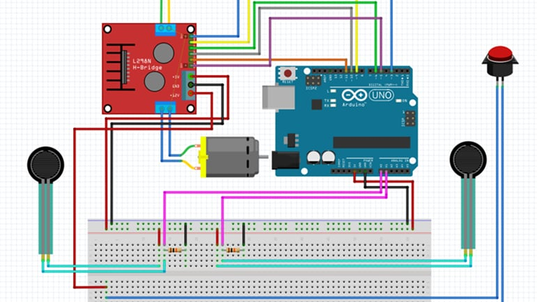

# arduino-motor-control
An Arduino project for controlling DC motors via L298N driver using analog pressure sensor inputs. Implements dead zone, hysteresis, and soft ramping to achieve smooth and stable mechanical leg movement.

## Features
- Motor direction control with hysteresis to prevent rapid direction changes  
- Dead zone implementation to ignore minor sensor fluctuations  
- Soft ramping for smooth acceleration and deceleration  
- Two implementation styles:  
  - Struct-based version (`struct_base` folder)  
  - Class-based version (`class_base` folder)  
